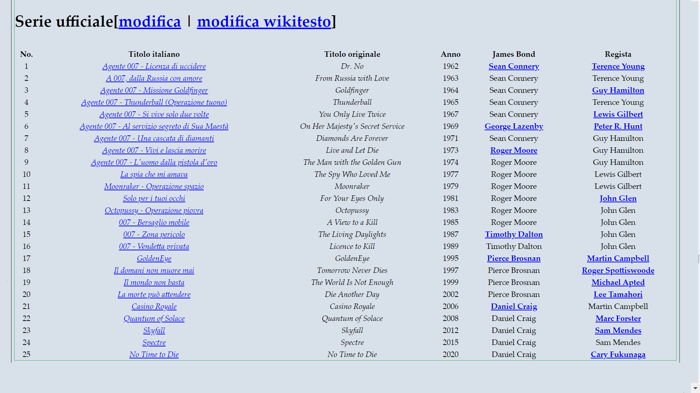

### Project description: Basic node web scrapping

This is a simple Node project allows you to extract values ​​from a web page through the JS `cheerio` and `request` libraries.

 
_______________________________________

 
 
 

### Descrizione progetto: Basic node web scrapping

Piccola applicazione Node che permette di estrarre alcuni valori d'interesse del programmatore attraverso la tecnica del web scrapping.

 

______________________________________

 
 
 

Il codice funziona con alcuni moduli di terze parti come:

 * request
 * cheerio

 `Cheerio` e' la libreria che permette d'acquisire e controllare i contenuti HTML restituiti dalla libreria `request`.
 
 Cheerio attraverso alcune funzioni come: .load(), .html() e text(), da' la possibilita' di caricare ed estrarre i contenuti in formato testuale o html, dei valori ritornati della richiesta HTTP effettuata da `request`

 La URL su cui lavora l'applicazione e': <b><i>https://it.wikipedia.org/wiki/Film_di_James_Bond</i></b>, la selezione avviene tramite alcuni nodi e classi HTML, i quali permettono di ottenere i dati della tabella:

 
 

 

 
 

 I campi estratti sono:

  * Numero Film
  * Titolo Originale
  * Titolo Italiano
  * Anno
  * Attore
  * Regista

   
   

  `Moduli di terze parti richiesti:`

        npm i nodemon
        npm i request
        npm i cheerio

 
 
<b>NB:</b> <i>Alcuni pacchetti poterbbero essere ritenuti <b>deprecated</b></i>

applicazione scritta da [giuseppe tarallo](http://dev-ita.it)
